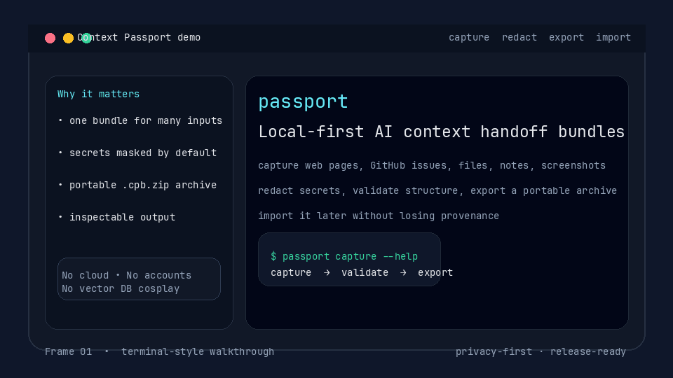

# Context Passport

Local-first, privacy-first AI context handoff bundles.

Context Passport turns messy AI copy-paste into a portable, inspectable, redacted artifact. Capture a page, GitHub issue, selected browser text, local file, screenshot, or manual note; validate it; redact secrets; export it; then hand it to another AI tool without leaking private context.

## Why this exists

AI tools are getting better, but context handoff is still primitive:

- screenshots in one place
- GitHub links in another
- terminal output pasted into chat
- secrets accidentally copied into prompts
- no reproducible record of what was given to the model

Context Passport creates a small local bundle with a manifest, source metadata, artifacts, hashes, and redaction records. No cloud account. No telemetry. No vector DB cosplay.

## Current v0 capabilities



High-quality video: [assets/context-passport-demo.mp4](assets/context-passport-demo.mp4)

- TypeScript monorepo
- CLI as source of truth
- local Fastify daemon for browser capture
- WXT browser extension popup
- versioned Zod bundle schema
- deterministic bundle hashing
- manual note capture
- URL capture with lightweight HTML-to-markdown extraction
- local file capture for logs, markdown, JSON, HTML, and screenshots/images
- GitHub repo/issue URL classification
- bundle validation
- portable `.cpb.zip` archive export/import
- human-readable inspect output
- redaction engine for:
  - GitHub tokens
  - OpenAI-style API keys
  - email addresses
  - local home paths
  - custom regex rules in core
- tests for core redaction/schema, CLI workflows, daemon capture, and extension payloads

## Install

```bash
npm install -g pnpm
pnpm install
pnpm build
```

## CLI usage

Capture a manual note:

```bash
pnpm passport capture --note "Debug notes and stack trace" --title "Debug handoff" --out ./bundle
```

Capture a public URL:

```bash
pnpm passport capture --url https://github.com/owner/repo/issues/1 --out ./issue-bundle
```

Capture a local file:

```bash
pnpm passport capture --file ./debug.log --title "Debug log" --out ./file-bundle
```

Validate:

```bash
pnpm passport validate ./bundle
```

Inspect:

```bash
pnpm passport inspect ./bundle
```

Preview redactions:

```bash
pnpm passport redact ./bundle
```

Apply redactions:

```bash
pnpm passport redact ./bundle --apply
```

Export/import a portable archive:

```bash
pnpm passport export ./bundle --out ./bundle.cpb.zip
pnpm passport import ./bundle.cpb.zip --out ./imported-bundle
```

## Browser capture

Start the local daemon:

```bash
pnpm --filter @context-passport/daemon build
node packages/daemon/dist/index.js
```

Build the extension:

```bash
pnpm --filter @context-passport/extension build
```

Load `packages/extension/.output/chrome-mv3` as an unpacked extension. The popup captures the current page title, URL, and selected text, then sends it to `http://127.0.0.1:17345/capture/note`.

## Bundle layout

```text
bundle/
  manifest.json
  artifacts/
    manual-note.md
```

Portable archive layout:

```text
bundle.cpb.zip
  manifest.json
  artifacts/
    manual-note.md
```

## Development

```bash
pnpm typecheck
pnpm test
pnpm build
```

## Product direction

Context Passport should stay boring and useful:

- local-first
- privacy-first
- explainable artifacts
- strong redaction before sharing
- no accounts
- no cloud sync
- no analytics

The bigger vision: become the standard `.har`-like handoff format for AI context.

## License

MIT
